<p align="center">
  
</p>

<p align="center">
  <strong>Less skills. Deeper connections.</strong><br>
  A lean, interconnected skill ecosystem for AI coding assistants.<br>
  65 skills · 204 connections · 43 signals · 13 platforms · MIT
</p>

<p align="center">
  <a href="https://rune-kit.github.io/rune"></a>
  <a href="https://rune-kit.github.io/rune#pricing"></a>
  <a href="https://rune-kit.github.io/rune#pricing"></a>
  <a href="https://t.me/xlabs_updates"></a>
</p>

<p align="center">
  <strong>Claude Code</strong> (native plugin) · <strong>Cursor</strong> · <strong>Windsurf</strong> · <strong>Google Antigravity</strong> · <strong>OpenAI Codex</strong> · <strong>OpenCode</strong> · <strong>Aider</strong> · <strong>GitHub Copilot CLI</strong> · <strong>Gemini CLI</strong> · <strong>Qoder</strong> · <strong>Qwen Coder</strong> · any AI IDE
</p>

## Why Rune?

Most skill ecosystems are either **too many isolated skills** (540+ that don't talk to each other) or **rigid pipelines** (A → B → C, if B fails everything stops).

Rune is a **mesh** — 65 skills with 204 connections + 43 signals across a 5-layer architecture. Skills call each other bidirectionally, forming resilient workflows that adapt when things go wrong.

```
Pipeline:  A → B → C → D         (B fails = stuck)
Hub-Spoke: A → HUB → C           (HUB fails = stuck)
Mesh:      A ↔ B ↔ C             (B fails = A reaches C via D→E)
           ↕       ↕
           D ↔ E ↔ F
```

## Benchmark: With Rune vs Without Rune

We ran 10 standardized coding tasks on Claude Code — once **without** Rune (vanilla), once **with** Rune — and measured tokens, cost, duration, and correctness.

### Headline Results

```
                Without Rune    With Rune     Delta
Avg Tokens:     541,400         454,491       ↓ 16%
Avg Cost:       $0.69           $0.65         ↓ 6%
Avg Duration:   2.3 min         2.1 min       ↓ 9%
Avg Tool Calls: 14              13            ↓ 7%
Correctness:    9/10            9/10          =
```

### Where Rune Shines: Complex Tasks

| Task | Difficulty | Tokens | Cost | Duration | Tools |
|------|-----------|--------|------|----------|-------|
| Refactor 450-line component | Medium | **-62%** | **-17%** | **-32%** | **-27%** |
| Full feature (auth + API + tests) | Complex | **-36%** | **-29%** | **-31%** | **-27%** |
| Add Zod validation | Easy | -9% | **-28%** | **-32%** | 0% |
| Dark mode across 6 components | Hard | ~0% | +10% | -7% | -6% |

Rune doesn't make Claude smarter — Claude already knows how to code. Rune makes Claude **disciplined**. The more complex the task, the more discipline matters.

> _"Without Rune, Claude writes code that works. With Rune, Claude writes code that lasts."_

<details>
<summary>Full 10-task breakdown</summary>

| # | Task | Diff | Tokens | Cost | Time | Correct |
|---|------|------|--------|------|------|---------|
| 1 | Zod Validation | Easy | -9% | -28% | -32% | ✅ → ✅ |
| 2 | Fix N+1 Query | Easy | +12% | +25% | +3% | ❌ → ❌ |
| 3 | Cursor Pagination | Med | +12% | +19% | -9% | ✅ → ✅ |
| 4 | Security Review | Med | +13% | +32% | +3% | ✅ → ✅ |
| 5 | Rate Limiting | Med | +12% | +5% | +5% | ✅ → ✅ |
| 6 | Refactor Component | Med | **-62%** | **-17%** | **-32%** | ✅ → ✅ |
| 7 | Dark Mode (6 files) | Hard | ~0% | +10% | -7% | ✅ → ✅ |
| 8 | DB Migration | Hard | +52% | +11% | +49% | ✅ → ✅ |
| 9 | Memory Leak Debug | Hard | +13% | +28% | -2% | ✅ → ✅ |
| 10 | Full Auth System | Complex | **-36%** | **-29%** | **-31%** | ✅ → ✅ |

_Methodology: Claude Code CLI headless mode (`claude -p --output-format json`), 10 tasks with fixture code, pattern-based correctness evaluation. Source: [`Benchmark/`](Benchmark/)_

</details>

---

## What's New (v2.23.0 — Native Skills)

> **v2.23.0 (2026-07-04):** Seven platform adapters move to the **Agent Skills open standard** (dir-per-skill `SKILL.md`, discovered and lazy-loaded by each platform's native loader). The headline fix: **Codex** dropped `.codex/skills/` from its scan list, so compiled skills were only findable via the AGENTS.md pointer — agents kept "re-finding" the path mid-session. Codex now emits to **`.agents/skills/`** (scanned CWD → repo root). Same treatment across the fleet: **cursor** `.cursor/rules/*.mdc` → `.cursor/skills/` (Cursor 2.4+ Skills, on-demand instead of always-on), **windsurf** → `.windsurf/skills/` (Cascade Skills), **copilot** → `.github/skills/`, **qoder** → `.qoder/skills/`, and **gemini/qwen** drop their all-skills-always-on context bombs (GEMINI.md bundle, QWEN.md `@import` wall) for native `.gemini/skills/` / `.qwen/skills/` + slim pointer files — a big context-window win on those platforms. Runtime hooks intentionally stay on `.cursor/rules` / `.windsurf/rules` (always-on is correct for hook context). Also fixes a YAML double-escaping bug that corrupted compiled frontmatter for skills with quoted descriptions on 6 platforms, and a duplicate `scripts/` copy in dir-per-skill builds. If you previously built for Codex/Cursor/Windsurf/Copilot/Gemini/Qwen/Qoder: re-run `npx @rune-kit/rune build` and delete the old output dirs. CI 1571/1571.

### Previous (v2.22.2 — Convergence, Dogfooded)

> **v2.22.2 (2026-07-04):** Patch: `rune setup` now installs tier skills into the Claude Code PLUGIN CACHE (newest version dir) instead of the executing package's own root — npx runs were copying Pro skills into npx's ephemeral cache (invisible to the plugin runtime, 'Unknown skill: rune:autopilot' returned), and source-checkout runs polluted the git tree. **v2.22.1:** tier-hook loader accepts PreCompact + SessionStart lifecycle events — required by Pro hooks v1.2.0 (context-reset). **v2.22.0:** The v2.21.0 gates went through a live-fire dogfood: fresh executor agents (zero author context) ran `converge` and `verification` Level 3.5 against a fixture with a dead Submit button, a handler-less Export button, a navigation-anchor decoy, and a declared placeholder. **Both gates caught the dead button with file:line evidence and zero false positives** — and the 16 ambiguities the executors reported became spec fixes: converge v0.2.0 adds a `deferred-debt` class (declared design debt can no longer force a false escalation), a `Plan Claims vs Reality` section (tasks marked `[x]` whose code doesn't exist — surfaced first-class), and derived story verdicts; verification v0.7.0 gets FAIL-dominates precedence, per-route reverse checks, and server/static entry-point exemptions. The dogfood fixture itself shipped as the seed of **`npm run eval`** — a behavioral eval harness that runs a fresh headless agent against fixture repos and asserts outcomes, because structural validation can't prove a skill makes an agent behave. Pro `autopilot` v1.6.0 now explicitly runs Phase 6.5 CONVERGE in autonomous mode.

### Previous (v2.21.0 — Convergence)

> **v2.21.0 (2026-07-03):** Kills the most expensive silent failure in AI-built apps: **the dead button** — UI renders, click does nothing, backend never existed. New `converge` skill (65th) re-reads your spec/plan/contracts as the sole source of intent and scans the ACTUAL code for `missing` / `partial` / `contradicts` / `unrequested` gaps, appending remediation tasks until spec and code converge (`cook` Phase 6.5, max 2 rounds then honest escalation). The whole chain got teeth: `ba` v1.2.0 emits story-sliced specs (P1/P2/P3 priorities, per-story **Independent Test**, **Key Entities**), `plan` v1.7.0 emits **contracts-first boundary artifacts** (`data-model.md` + `contracts/` + `quickstart.md`) with a P1 zero-coverage HARD-GATE and a Data→Logic→Endpoint→UI ordering law (UI is structurally last), `verification` v0.6.0 adds **Level 3.5 INTERACTION WIRED** (traces button → handler → route across React/Svelte/Vue syntax), `completion-gate` v1.9.0 makes the E2E flow trace mandatory for UI+data diffs (single-phase included), and `deploy` v0.8.0 warns before shipping UI+data changes with no wiring evidence. 3 new mesh signals (`convergence.gaps`, `convergence.clean`, `integration.verified`). Every gate is diff-scoped — legacy debt warns, new work fails.

### Previous (v2.20.0 — Spec Discipline)

> **v2.20.0 (2026-07-02):** Closes the "plan without spec" gap — a `brainstorm → plan → cook` chain no longer skips `ba`. Two new gates (`brainstorm` spec-presence + `cook` Phase 0 **Spec-Backfill Gate**) force requirements before code on every bypass path, not just brainstorm's. Batch also lands `ba` v1.1.0 (EARS `FR-n` functional-requirements layer), `adversary` v0.4.0 (reasoning-mode catalog + steelman-first), and a context-hook fix (session_id keying — no more false "100% compact"). Mesh **204 connections**, 1,559 tests.

> **v2.19.0 (2026-06-20):** New `rune dashboard` verb renders Rune's flagship **human-visible artifact** — a self-contained HTML "Codebase Briefing + Governance Scorecard" you can open in a meeting with no server, no CDN, no telemetry, nothing leaving the machine. The headline is the governance/value **verdict** (0-100 score with honest `—` empty-state), not a code graph — the buyer's codebase graph lives in the **Understand** tab (node/edge filters, domain view with flow steps, guided tour, node inspector, PNG/SVG/JSON export, keyboard-accessible canvas). Five-tab IA: Verdict → Govern / Measure / Understand / Improve. **Tier-aware** — Free sees verdict + measure, **Pro** adds a "My Lens" cost/ROI persona, **Business** unlocks the full Governance Scorecard (gate-outcome ledger + compliance coverage). Honest by design: empty states render `—` not fabricated numbers, and Free/Pro see an upsell that *describes* value rather than fake data. XSS-hardened + 100% self-contained. Internals: `comprehension.js` split 3584 → 1255 LOC (browser app extracted to `comprehension-client.js`, byte-identical output). Built on existing onboard / autopsy / analytics / mesh generators — original work, no external dependency. CI 1558/1558.

### Previous (v2.18.1 — Setup Installs Tier Skills, Not Just Hooks)

> **v2.18.1 (2026-05-17):** Bug fix — `rune setup --tier pro|business` now copies the tier's `skills/` directories into the Free plugin's `skills/` folder. Before this fix, paid tiers shipped hooks only, so `rune:autopilot` (Pro) returned `Unknown skill: rune:autopilot` because the SKILL.md was at `Pro/skills/autopilot/` but invisible to the Claude Code plugin runtime. New `installTierSkills` in `compiler/commands/setup.js` runs after `installHooks`, copies each `<tierRoot>/skills/<name>/` into `<runeRoot>/skills/`, idempotent (skips existing — protects Free skills from clobber and user-edited Pro skills from stomp), with path-traversal guard + symlink rejection + partial-copy cleanup + version-drift detection. Paired with Pro `autopilot-v1.5.0` (Step 0 LOAD now reads user-message context for plan path — same pattern cook uses). 25/26 setup tests pass (1 skipped on Windows — symlink test needs admin/dev-mode). Full CI 1444 tests.

### Previous (v2.18.0 — Cross-Platform Reach + Discipline Tightening)

> **v2.18.0 (2026-05-15):** Compiler grew from 8 → 13 platforms with five new adapters: **Aider** (per-skill `aider/rules/` + auto-generated `.aider.conf.yml` `read:` array), **GitHub Copilot CLI** (`.github/instructions/*.instructions.md` w/ documented `applyTo` YAML), **Gemini CLI** (bundled `GEMINI.md` for single-file context), **Qoder** (`.qoder/rules/` + AGENTS.md), **Qwen Coder** (`qwen/skills/` + `QWEN.md` with `@import`). New `adapter.generateExtraFiles()` hook with path-traversal guard + frozen stats snapshot — replaces ad-hoc adapter special-cases (codex AGENTS.md migrated). Discipline tightening: `design` v0.6.0 adds Step 2.9 Rules 4/5/6 (measurable constraints, no #000/#fff/lorem ipsum, CJK-first font stack); `skill-forge` v1.9.0 adds soft `examples/` convention for output-format skills; `sentinel-env` v0.4.0 expands Tier 8 binary detection (Bun, Cargo, Deno, Volta, asdf, proto). New `CONTRIBUTING.md` "What we don't accept" non-goals section. Source: graft from `nexu-io/html-anything` (Apache-2.0). CI 1435/1435.

### Previous (v2.17.1 — One-Command Setup Wizard)

> **v2.17.1 (2026-05-06):** New `rune setup` interactive wizard collapses the multi-step `cd <project> && export RUNE_PRO_ROOT && rune hooks install --preset gentle --tier pro` workflow into one command — auto-detects Pro/Business tiers across env var / sibling / well-known paths, asks for scope (current project / global) + preset, installs hooks. New `--global` flag on `rune hooks install` writes to `~/.claude/settings.json` (every Claude Code session, regardless of project). Non-interactive mode via `--here` / `--global` / `--tier` / `--preset` / `--dry` flags. Anti-paywall — wizard ships in Free, NOT Pro/Business (tier-agnostic infrastructure UX). Doc sweep: README "One-Command Setup", HOOKS.md restructure, agent skill-routing row for "set up rune". CI 1376/1376.

### Previous (v2.17.0 — Quarantine + Hook Drift Reporter)

> **v2.17.0 (2026-05-06):** New L3 skill `quarantine` ships a PostToolUse advisory hook for untrusted external content (MCP user-content, WebFetch, upload Reads). Honest scope: hook lands `[QUARANTINE-NOTICE]` in next-turn `additionalContext`, biasing the model to treat prior external content as data — NOT structural defense. Layered against `permissions.deny` (egress) + `integrity-check` (state). Default trusted-MCP allowlist (linear / github / jira / atlassian / Drive / neural-memory) skips advisory; operator extends at `~/.claude/quarantine.d/trusted-mcp-allowlist.txt`. Per-session disable via `QUARANTINE_DISABLE=1`. Wired into `rune hooks install --preset gentle|strict`. New `rune doctor --hooks` drift reporter. CI 1367/1367.

### Previous (v2.16.1 — Skill Enrichment + Triage Workflow + Output Modes)

> **v2.16.1 patch (2026-05-02):** `ba` v0.13.0 → v1.0.0 first stable major (no functional changes — maturity stamp). Doc/signal hygiene: CLAUDE.md "Current Wave" synced; 4 terminal-observability signals whitelisted in `validate-signals.js`. CI 1349/1349.


- **`debug` v1.2.0 — Step 0: Build Feedback Loop** — 10-rank ladder (failing test → curl → CLI snapshot → headless browser → trace replay → throwaway harness → fuzz → bisection → differential → HITL script). Codifies "the loop is the speed limit" — a fast deterministic pass/fail signal turns debugging into mechanical bisection. Skip if repro is already < 5s and deterministic; > 10 min loop construction triggers 3-Fix Escalation (architecture is the problem).
- **`plan` v1.6.0 — Vertical Slice Mode** — tracer-bullet task decomposition. Each task = end-to-end path through schema + API + UI + test, demoable on its own. AFK / HITL classification. Stops "horizontal layer" planning that blocks on the slowest layer.
- **`context-engine` v1.2.0 — Caveman Output Mode** — auto-activates on context ORANGE / RED (or `/caveman`). Strips filler / articles / hedging / pleasantries while preserving full technical accuracy (~75% output reduction). Auto-clarity exceptions for security warnings, destructive-action confirmations, multi-step sequences, root-cause diagnosis.
- **`ba` v1.0.0 — Synthesis Mode + Out-of-Scope WRITE** — when prior conversation has rich context (pasted spec, > 1000 words, continuation session), extract Requirements Document with source citations and confirm instead of re-interviewing. Step 1.6 closes the `.out-of-scope/` write loop: explicit mid-elicitation rejections produce a durable `.out-of-scope/<slug>.md` record so future sessions don't re-litigate.
- **`context-pack` v0.3.0 — Agent Brief Variant** — durable handoff format for AFK agents (issue tracker queues, autopilot multi-session work). Behavioral over procedural; type names over file:line. Survives codebase drift between handoff and execution.
- **`review-intake` v1.3.0 — Issue Triage Mode** — new mode for issue tracker items (PR Review remains default). State machine: needs-triage → needs-info / ready-for-agent / ready-for-human / wontfix. Repro-first HARD-GATE for bugs (calls `debug` Step 0 if multi-component). Vague issues route to `ba` Synthesis Mode for grilling. AGENT-BRIEF emission for `ready-for-agent`.
- **5 new mesh signals** — `output.density.set`, `triage.classified`, `agent.brief.ready`, `outofscope.recorded` + `EXTERNAL_TRIGGER_SIGNALS` whitelist concept (symmetric to `INTENTIONAL_BROADCAST_SIGNALS`).
- **Validator cleanups** — `validate-skills.js` Done-When regex relaxed (scope-aware, supports mode-based subsections); 9 pre-existing validation errors cleaned. `validate-signals.js` gained `EXTERNAL_TRIGGER_SIGNALS` set.
- **Provenance** — second graft pass from [`mattpocock/skills`](https://github.com/mattpocock/skills) (MIT). Round 1 had silently grafted 7 patterns (improve-architecture, CONTEXT.md, design-it-twice, zoom-out, oracle-mode, grill, out-of-scope); Round 2 + 2b documented + extended.

### Previous (v2.15.0 — Second Opinion + Cross-Provider + Routing Clarity)

- **`adversary` v0.2.0 — Mode: oracle** — when `agent.stuck` fires from `debug` (3 disproved hypotheses) or `fix` (2+ failed attempts), oracle-mode dispatches a stateless second-model pass with explicit "no prior context" framing. Bundle format is regex-validated (`[SYSTEM]` invariant role-priming + `[USER]` template + `### File N`), token-capped (100k bundle, 4k per file, 12 files max), citation-required reply contract. Secrets auto-redacted. Breaks the confirmation-bias loop that scout's zoom-out (structural pivot) cannot.
- **`session-bridge` v0.8.0 — Detach Mode** — async escalation primitive. Heavy-model second-opinion calls (1-10 min wall time) no longer block the primary agent. `.rune/oracle-pending/<sessionId>.json` is the rendezvous file; idempotent dispatch (bundleHash-keyed); 10min default timeout; 24h orphan cleanup on session start. `cook` Phase 4 and `team` Phase 3 reattach via filesystem poll between adjacent tasks.
- **`context-engine` v1.1.0 — Mode: preview** — pre-flight cost gate. Caller emits `context.preview` BEFORE bundle build with file list + estimated tokens (chars × 0.25). Per-caller thresholds: adversary 50k/100k, team 30k/80k (per worker), review 40k/100k, audit 60k/120k. Action enum `proceed | warn | block`. Override via `RUNE_CONTEXT_THRESHOLDS_<CALLER>`. Stops `team` parallel workstreams from silently blowing $20 of Opus tokens.
- **Cross-provider model mapping** — 5 non-Anthropic adapters now translate `model: opus|sonnet|haiku` to provider-correct names. **codex** → gpt-5-pro / gpt-5 / gpt-5-mini. **antigravity** → gemini-3-pro / gemini-3-flash / gemini-3-flash-lite. **opencode / openclaw / generic** → tier:heavy / tier:mid / tier:light (provider-agnostic). claude / cursor / windsurf remain no-op (Anthropic backend understands native names).
- **Routing clarity sweep** — all 63 SKILL.md descriptions now double-quoted (YAML safety). 13 ambiguous-name skills got explicit "Use when…" routing hints so skill-router doesn't have to guess: ba, completion-gate, constraint-check, doc-processor, integrity-check, logic-guardian, onboard, preflight, sentinel-env, watchdog, worktree, hallucination-guard, mcp-builder.
- **4 new mesh signals** — `oracle.dispatched`, `oracle.response`, `oracle.failed`, `context.preview`. All registered in Signal Catalog with full emit/listen mapping. `agent.stuck` listeners updated to include adversary in addition to scout.
- **1,331 tests** — +71 from v2.14.0 across 5 new test files: adapter-model-mapping (18), oracle-bundle-format (19), oracle-pending-schema (16), context-preview-signal (13), skill-description-quality (5).

### Previous (v2.14.0 — Deep Modules)

- **`improve-architecture` skill (NEW L2, opus)** — controlled vocabulary (Module / Interface / Implementation / Depth / Seam / Adapter / Leverage / Locality), numeric depth-leverage-locality scoring (1–5 each), 4 dependency categories, structured proposal payloads.
- **TDD vertical-slicing HARD-GATE** — `test` v1.3.0 catches "horizontal slicing" (5 tests before any GREEN), commit-pair audit trail, shape-test smell detector.
- **`.out-of-scope/` knowledge base** — `ba` v0.11.0 reads, `review-intake` v1.2.0 writes. Stops re-litigation of rejected features.
- **CONTEXT.md inline-sharpen + ADR 3-criteria gate** — `journal` v0.4.0 only opens an ADR when sum ≥ 11 + each axis ≥ 3.
- **Agent Brief durability** — `context-pack` v0.2.0 regex smell tests block stale paths/line numbers.
- **Design-It-Twice mode** — `brainstorm` v0.6.0 with constraint-pinned parallel subagents + diversity score gate.
- **Zoom-out + explore-first micro-utilities** — `scout` v0.4.0 listens for `agent.stuck`; `ba` Step 2.0 HARD-GATE requires tool-call evidence.

### Previous (v2.13.0 — Script Contract + Media Pack)

- **`@rune-pro/media` pack v1.0.0** — new Pro pack: raster image generation across 5 providers (Codex CLI, DALL-E, Replicate, Stability AI, local SD), prompt engineering with 4-gate safety check (trademark, public-figure, prompt-injection, uncanny-precondition), batch asset pipeline with multi-resolution variants + WebP/AVIF conversion + EXIF strip.
- **`sentinel-env` v0.3.0** — 9-tier binary detection for hard-dependency checks.
- **`skill-forge` v1.8.0** — new Phase 5.25 "Script Contract" — helper scripts must follow stdout=paths / stderr=diagnostics / `--json` opt-in / semantic exit codes. HARD-GATE on pre-ship verification.
- **OpenClaw adapter** — `generateManifest` now declares `artifactConvention`.

### Previous (v2.12.0 — Auto-Discipline)

- **Runtime auto-discipline** — `rune hooks install` wires native hooks on Claude Code, Cursor, Windsurf, Antigravity so `preflight`, `sentinel`, `completion-gate` auto-fire before tool use. No more "remember to invoke the skill."
- **Three presets** — `strict` (blocking gates), `gentle` (warnings, default), `off` (uninstall). Idempotent install / uninstall with full restore of user hooks.
- **Multi-tier hook layering** — `--tier pro` / `--tier business` stack paid-tier hooks on top of Free using a tier-tagged manifest at `$<TIER>_ROOT/hooks/manifest.json`. Free compiler stays tier-agnostic (MIT-clean).
- **logic-guardian v0.3.0** — `rune init` now auto-seeds `.rune/INVARIANTS.md` with project-detected rules (money math, state machines, payment flows). Preflight reads it as a hard gate.
- **session-bridge v0.7.0** — emits `context.compact.imminent` signal; cook/plan/team listen and checkpoint work before compaction.
- **autopilot v1.1.0** (Pro) — honors the hooks manifest; runs overnight with the same blocking gates your interactive sessions enforce.
- **Security** — tier name sanitization (path-traversal-safe), precise `statusLine` detection (no false-positive uninstall of user commands), `overrides` migration for legacy hook entries.
- **1,152 tests** — +31 from v2.11.0 covering hooks adapter, tier manifest loader, override migration, and review regressions.

### Previous (v2.11.0)

- **Mesh integrity** — 8 dead wires fixed, 5 workflow gaps closed (hotfix chain, API versioning, monorepo mode, feature flags, dependency upgrade campaigns)
- **audit v0.4.0** — DX Review Mode: Addy Osmani's 8 developer experience principles with scoring rubric and browser-pilot integration
- **cook v2.4.0** — remediation cycle counter + upstream inconsistency protocol
- **problem-solver v0.4.0** — Cynefin, SWOT, PESTLE, Porter's Five Forces, ethics framework
- **plan v1.5.0** — autopilot suggested_next: autonomous execution path for Pro users after plan approval
- **Autopilot routing** — skill-router Tier 1 entry for Pro autopilot ("auto", "làm hết", "đi ngủ" → autonomous mode)

### Previous (v2.10.0)

- **marketing v0.4.0** — anti-AI copy rules (banned phrases, 5 hook types, specificity mandate), expanded SEO audit with schema markup guide (10 types + `@graph` pattern), programmatic SEO awareness (4 playbooks), optional Pro content-scorer/cro-analyst integration
- **Pro growth pack v1.1.0** — 3 new skills (content-scorer, cro-analyst, marketing-psych) + 6 existing skills enriched with SEO Machine patterns

### Previous (v2.8.0)

- **Anti-Loop Intelligence** — 7 core skills enriched with execution loop detection, saturation analysis, error pattern matching, artifact folding, budget-aware progression, and recovery policy routing
- **cook v2.1.0** — observation/effect ratio tracking (detects stuck agents reading without writing) + budget-aware phase progression with hard caps on replans, quality retries, and session tool calls
- **completion-gate v1.8.0** — execution loop audit: classifies tool calls as observation vs effect, flags imbalanced ratios and repeating sequences in gate reports
- **scout v0.3.0** — info saturation detection: tracks entity discovery rate and content similarity to stop scanning when diminishing returns detected
- **research v0.4.0** — diminishing returns detection: monitors new-entity ratio and result overlap across searches to skip redundant queries
- **context-engine v0.9.0** — artifact folding: large tool outputs (>4000 chars or >120 lines) saved to `.rune/artifacts/` with compact preview in context
- **debug v1.0.0** — known error pattern catalog: 8 error archetypes (STATELESS_LOSS, MODULE_NOT_FOUND, TYPE_MISMATCH, ASYNC_DEADLOCK, etc.) with recovery hints + error fingerprinting for dedup
- **fix v0.8.0** — recovery policy matrix: classifies errors into 8 types (INPUT_REQUIRED→PROMPT_USER, TIMEOUT→RETRY, POLICY_BLOCKED→ABORT, etc.) before attempting fixes
- **Source attribution cleanup** — removed all enrichment credit lines from skill files to reduce context noise

### Previous (v2.7.0)

- **Deep Knowledge** — 8 core skills enriched with battle-tested patterns: context compaction, structured cumulative memory, milestone analysis, multi-provider adapters, AI-driven interview, prompt-as-API-contract, token budget tracking, incremental stream processing
- **946 Tests** — compiler + signals + hooks + scripts + status + visualizer validation

### Previous (v2.6.0)

- **Mesh Signals** — event-driven skill communication via frontmatter. Skills declare `emit` and `listen` signals; compiler builds a signal graph in `skill-index.json`. 23 signals across 15 core skills
- **Signal Validation** — `scripts/validate-signals.js` checks orphan listeners (hard error), unlistened emitters (warning), signal naming conventions
- **Mesh Contract** (v2.5.0) — `.rune/contract.md` project-level invariants enforced by cook + sentinel as hard gates
- **Tier Override** — Pro/Business packs override Free packs with skill-level merging
- **Scripts Bundling** — compiler copies `scripts/` directories, resolves `{scripts_dir}` placeholders

### Signal Graph

Skills communicate through declarative signals — no runtime event bus, just metadata for discovery, validation, and routing:

```
scout ──emit:codebase.scanned──→ plan, brainstorm
fix ────emit:code.changed──────→ test, sentinel, review, preflight, verification
test ───emit:tests.passed──────→ deploy
test ───emit:tests.failed──────→ debug
sentinel─emit:security.passed──→ deploy
debug ──emit:bug.diagnosed─────→ fix
deploy ─emit:deploy.complete───→ watchdog
cook ───emit:phase.complete────→ session-bridge
```

## What Rune Is (and Isn't)

Rune started as a **Claude Code plugin** and now compiles to **every major AI IDE**. Same 65 skills, same mesh connections, same workflows — zero knowledge loss across platforms.

| | Rune Provides | Claude Code Provides |
|---|---|---|
| **Workflows** | 8-phase TDD cycle (cook), parallel DAG execution (team), rescue pipelines | Basic tool calling |
| **Quality Gates** | preflight + sentinel + review + completion-gate (parallel) | None built-in |
| **Domain Knowledge** | 14 extension packs (trading, SaaS, mobile, etc.) | General-purpose |
| **Cross-Session State** | .rune/ directory (decisions, conventions, progress) | Conversation only |
| **Mesh Resilience** | 203 skill connections + 40 mesh signals, fail-loud-route-around | Linear execution |
| **Cost Optimization** | Auto model selection (haiku/sonnet/opus per task) | Single model |
| | | |
| **Sandbox & Permissions** | — | Claude Code handles this |
| **Agent Spawning** | — | Claude Code's Task/Agent system |
| **MCP Integration** | — | Claude Code's MCP protocol |
| **File System Access** | — | Claude Code's tool permissions |

### Common Misconceptions

| "Rune doesn't have..." | Reality |
|---|---|
| Task graph / DAG | `team` skill: DAG decomposition → parallel worktree agents → merge coordination |
| CI quality gates | `verification` skill: lint + typecheck + tests + build (actual commands, not LLM review) |
| Memory / state | `session-bridge` + `journal`: cross-session decisions, conventions, ADRs, module health |
| Multi-model strategy | Every skill has assigned model: haiku (scan), sonnet (code), opus (architecture) |
| Agent specialization | 62 specialized skills with dedicated roles (architect, coder, reviewer, scanner, researcher, BA, scaffolder) — each runs as a Task agent via Claude Code |
| Security scanning | `sentinel`: OWASP patterns, secret scanning, dependency audit. `sast`: static analysis |

## Install

### One-Command Setup (recommended)

After installing the plugin, run the wizard once to wire hooks the way you want them — pick scope, pick tiers, done:

```bash
npx @rune-kit/rune setup
```

The wizard auto-detects what you have:

```
Rune Setup Wizard
──────────────────
Free version:    2.18.0 (cached)
Pro detected:    sibling (../Pro) (v1.1.0)
Business:        not detected

Where to install hooks?
  [c] Current project — D:/MyProject/.claude/settings.json
  [g] Global          — ~/.claude/settings.json
       (every Claude Code session, regardless of project)

Scope [c/g] (default c): g
Install Pro tier? [Y/n]: y
Preset [g/s] (default g): g

✓ Wired 5 hooks to ~/.claude/settings.json
  Verify: rune doctor --hooks
```

**What does the wizard do?** It writes Rune-managed entries to `.claude/settings.json` (project-local OR global) so Claude Code auto-fires `preflight`, `sentinel`, `dependency-doctor`, `completion-gate`, and `quarantine` at the right moments. With `--tier pro`, it also wires `loop-circuit-breaker` (auto-engages only in autopilot sessions).

**Non-interactive mode** (CI / scripted):

```bash
npx @rune-kit/rune setup --here --preset gentle --tier pro
npx @rune-kit/rune setup --global --preset strict --tier pro,business
npx @rune-kit/rune setup --here --no-tier --dry      # preview without writing
```

### Claude Code (Native Plugin)

```bash
# Install via Claude Code CLI
claude plugin add rune-kit/rune
```

Or add manually in `~/.claude/settings.json` under `installed_plugins`.

Full mesh: subagents, hooks, adaptive routing, mesh analytics. **Run `npx @rune-kit/rune setup` afterward to wire hooks** (see One-Command Setup above).

### Cursor / Windsurf / Antigravity / Any IDE

```bash
# Compile Rune skills for your platform
npx @rune-kit/rune init

# Or specify platform explicitly
npx @rune-kit/rune init --platform cursor
npx @rune-kit/rune init --platform windsurf
npx @rune-kit/rune init --platform antigravity
```

This compiles all 65 skills into your IDE's rules format. Same knowledge, same workflows.

### Platform Comparison

| Feature | Claude Code | Cursor / Windsurf / Others |
|---------|-------------|---------------------------|
| Skills available | 64/64 | 64/64 |
| Mesh connections | 204 sync + 43 signals (programmatic) | 204 sync + 43 signals (rule references) |
| Workflows & HARD-GATEs | Full | Full |
| Extension packs | 14 | 14 |
| Subagent parallelism | Native | Sequential fallback |
| Lifecycle hooks | 8 hooks (JS runtime) | Inline MUST/NEVER constraints |
| Adaptive model routing | haiku/sonnet/opus | Single model |
| Mesh analytics | Real-time metrics | Not available |

**Same power, different delivery.** Claude Code gets execution efficiency; other IDEs get the same knowledge and workflows.

## Quick Start

```bash
# Onboard any project (generates CLAUDE.md + .rune/ context)
/rune onboard

# Build a feature (full TDD cycle)
/rune cook "add user authentication with JWT"

# Debug an issue
/rune debug "login returns 401 for valid credentials"

# Security scan before commit
/rune sentinel

# Refactor legacy code safely
/rune rescue

# Full project health audit
/rune audit

# Respond to a production incident
/rune incident "login service returning 503 for 30% of users"

# Generate design system before building UI
/rune design "trading dashboard with real-time data"

# Bootstrap a new project from scratch (v2.1.0)
/rune scaffold "REST API with auth, payments, and Docker"

# Deep requirement analysis before building
/rune ba "integrate Telegram bot with trading signals"

# Auto-generate project documentation
/rune docs init

# Build an MCP server
/rune mcp-builder "weather API with forecast tools"
```

## Auto-Discipline (Claude Code Hooks)

Turn Rune skills into ambient runtime — no more `/rune preflight` every time. Install once, skills auto-fire on relevant tool calls:

```bash
# Wire Rune quality gates into Claude Code (.claude/settings.json)
npx @rune-kit/rune hooks install --preset gentle

# Preset options:
#   gentle  — advisory, never blocks (default)
#   strict  — blocks tool call on BLOCK verdict
#   off     — uninstall

# Inspect current wiring
npx @rune-kit/rune hooks status

# Remove (preserves user-authored hooks)
npx @rune-kit/rune hooks uninstall
```

What gets wired:

| Event | Skill | When it fires |
|---|---|---|
| PreToolUse(Edit\|Write) | preflight | Before Claude edits source files |
| PreToolUse(Bash) | sentinel | Before shell commands (catches `git commit`, secrets) |
| PostToolUse(Edit\|Write) | dependency-doctor | After dependency manifest edits |
| Stop | completion-gate | End of session — validates claims against evidence |

Rune only manages entries tagged with its command signature. User-authored hooks in the same events are preserved on install/uninstall.

### Stacking paid tiers (Pro, Business)

Paid tiers ship their own `hooks/manifest.json`. Point Rune at the install root and pass `--tier`:

```bash
export RUNE_PRO_ROOT=~/rune-pro
rune hooks install --preset gentle --tier pro

# Stack Free + Pro + Business in one command
export RUNE_BUSINESS_ROOT=~/rune-business
rune hooks install --preset gentle --tier pro --tier business
```

Multi-platform: tier hooks compile to Claude Code, Cursor, Windsurf, and Antigravity with the same command — no Claude-only lock-in.

## Architecture

### 5-Layer Model

```
╔══════════════════════════════════════════════════════╗
║  L0: ROUTER (1)                                      ║
║  Meta-enforcement — routes every action               ║
║  skill-router                                         ║
╠══════════════════════════════════════════════════════╣
║  L1: ORCHESTRATORS (5)                                ║
║  Full lifecycle workflows                             ║
║  cook │ team │ launch │ rescue │ scaffold             ║
╠══════════════════════════════════════════════════════╣
║  L2: WORKFLOW HUBS (29)                               ║
║  Cross-hub mesh — the key differentiator              ║
║                                                        ║
║  Creation:    plan │ scout │ brainstorm │ design │     ║
║               skill-forge │ ba │ mcp-builder │ graft   ║
║  Development: debug │ fix │ test │ review │ db         ║
║  Quality:     sentinel │ preflight │ onboard │         ║
║               audit │ perf │ review-intake │           ║
║               logic-guardian                            ║
║  Delivery:    deploy │ marketing │ incident │ docs     ║
║  Rescue:      autopsy │ safeguard │ surgeon            ║
║  Security:    adversary                                ║
║  Velocity:    retro                                    ║
╠══════════════════════════════════════════════════════╣
║  L3: UTILITIES (27)                                   ║
║  Stateless, pure capabilities                         ║
║                                                        ║
║  Knowledge:   research │ docs-seeker │ trend-scout     ║
║  Reasoning:   problem-solver │ sequential-thinking     ║
║  Validation:  verification │ hallucination-guard │     ║
║               completion-gate │ constraint-check │     ║
║               sast │ integrity-check                   ║
║  State:       context-engine │ journal │               ║
║               session-bridge                           ║
║  Monitoring:  watchdog │ scope-guard                   ║
║  Media:       browser-pilot │ asset-creator │          ║
║               video-creator                            ║
║  Deps:        dependency-doctor                        ║
║  Workspace:   worktree                                 ║
║  Git:         git                                      ║
║  Documents:   doc-processor                            ║
║  Security:    sentinel-env                             ║
║  Memory:      neural-memory                            ║
║  Packs:       context-pack                             ║
║  Slides:      slides                                   ║
╠══════════════════════════════════════════════════════╣
║  L4: EXTENSION PACKS (14)                             ║
║  Domain-specific, install what you need                ║
║                                                        ║
║  @rune/ui │ @rune/backend │ @rune/devops │            ║
║  @rune/mobile │ @rune/security │ @rune/trading │      ║
║  @rune/saas │ @rune/ecommerce │ @rune/ai-ml │        ║
║  @rune/gamedev │ @rune/content │ @rune/analytics │    ║
║  @rune/chrome-ext │ @rune/zalo                         ║
╚══════════════════════════════════════════════════════╝
```

### Layer Rules

| Layer | Can Call | Called By | State |
|-------|---------|----------|-------|
| L0 Router | L1-L3 (routing) | Every message | Stateless |
| L1 Orchestrators | L2, L3 | L0, User | Stateful (workflow) |
| L2 Workflow Hubs | L2 (cross-hub), L3 | L1, L2 | Stateful (task) |
| L3 Utilities | Nothing (pure)* | L1, L2 | Stateless |
| L4 Extensions | L3 | L2 (domain match) | Config-based |

\*L3→L3 exceptions: `context-engine`→`session-bridge`, `hallucination-guard`→`research`, `session-bridge`→`integrity-check`

### Cost Intelligence

Every skill has an auto-selected model for optimal cost:

| Task Type | Model | Cost |
|-----------|-------|------|
| Scan, search, validate | Haiku | Cheapest |
| Write code, fix bugs, review | Sonnet | Default |
| Architecture, security audit | Opus | Deep reasoning |

Typical feature: ~$0.05-0.15 (vs ~$0.60 all-opus).

## Key Workflows

### `/rune cook` — Build a Feature

```
Phase 0 RESUME     → detect existing .rune/plan-*.md, load active phase
Phase 1 UNDERSTAND → scout scans codebase, ba elicits requirements
Phase 2 PLAN       → plan creates master plan + phase files
Phase 3 TEST       → test writes failing tests (TDD red)
Phase 4 IMPLEMENT  → fix writes code (TDD green)
Phase 5 QUALITY    → preflight + sentinel + review (parallel)
Phase 6 VERIFY     → verification + hallucination-guard
Phase 7 COMMIT     → git creates semantic commit
Phase 8 BRIDGE     → session-bridge saves state, announce next phase
```

Multi-session: Phase 0 detects existing plans and resumes from the current phase. One phase per session = small context = better code.

### `/rune rescue` — Refactor Legacy Code

```
Phase 0 RECON      → autopsy assesses damage (health score)
Phase 1 SAFETY NET → safeguard writes characterization tests
Phase 2-N SURGERY  → surgeon refactors 1 module per session
Phase N+1 CLEANUP  → remove @legacy markers
Phase N+2 VERIFY   → health score comparison (before vs after)
```

### `/rune launch` — Deploy + Market

```
Phase 1 PRE-FLIGHT → full test suite
Phase 2 DEPLOY     → push to platform
Phase 3 VERIFY     → live site checks + monitoring
Phase 4 MARKET     → landing copy, social, SEO
Phase 5 ANNOUNCE   → publish content
```

## Mesh Resilience

If a skill fails, the mesh adapts:

| If this fails... | Rune tries... |
|---|---|
| debug can't find cause | problem-solver (different reasoning) |
| docs-seeker can't find docs | research (broader web search) |
| scout can't find files | research + docs-seeker |
| test can't run | deploy fix env, then test again |

Loop prevention: max 2 visits per skill, max chain depth 8.

## Cross-Session Persistence

Rune preserves context across sessions via `.rune/`:

```
.rune/
├── decisions.md     — architectural decisions log
├── conventions.md   — established patterns & style
├── progress.md      — task progress tracker
└── session-log.md   — brief session history
```

Every new session loads `.rune/` automatically — zero context loss.

## Extension Packs

Domain-specific skills that plug into the core mesh:

| Pack | Skills | For |
|------|--------|-----|
| @rune/ui | design-system, components, a11y, animation | Frontend |
| @rune/backend | api, auth, database, middleware | Backend |
| @rune/devops | docker, ci-cd, monitoring, server, ssl | DevOps |
| @rune/mobile | react-native, flutter, app-store, native | Mobile |
| @rune/security | owasp, pentest, secrets, compliance | Security |
| @rune/trading | fintech, realtime, charts, indicators | Fintech |
| @rune/saas | multi-tenant, billing, subscription, onboarding | SaaS |
| @rune/ecommerce | shopify, payment, cart, inventory | E-commerce |
| @rune/ai-ml | llm, rag, embeddings, fine-tuning | AI/ML |
| @rune/gamedev | threejs, webgl, game-loops, physics | Games |
| @rune/content | blog, cms, mdx, i18n, seo | Content |
| @rune/analytics | tracking, a/b testing, funnels, dashboards | Growth |

### Rune Pro — $49 lifetime

> *Free Rune makes Claude disciplined. Pro makes Claude self-aware.*

**Context Intelligence** — the headline Pro feature. Claude Code auto-compacts at random, wiping your session context. With Pro, Claude **knows** when context is filling up — and proactively saves decisions, progress, and discoveries before compact hits.

```
Free:  Claude is blind to context pressure → auto-compact → amnesia
Pro:   Claude sees real-time context % → saves state → compact → reloads → zero loss
```

How it works: `rune-pulse` (statusline) reads `context_window.used_percentage` from Claude Code, writes to temp file. `context-inject` hook injects warnings into Claude's context at 70% / 80% / 90%. Claude triggers `session-bridge` + `neural-memory` to persist everything. After `/compact`, `session-start` reloads `.rune/` state — Claude picks up exactly where it left off.

**Autopilot** — approve a plan, walk away. Autonomous multi-session execution with zero-HIGH-tolerance quality gates, baseline regression checks, cross-phase coherence review, and structured completion reports. `cook` gets the job done. `autopilot` gets it done while you sleep.

**Pro Packs** — 9 domain packs:

| Pack | What it does |
|------|-------------|
| **Product** | PRDs from user stories, roadmap prioritization, KPI dashboards, release comms, competitive analysis |
| **Sales** | Account research briefs, call prep with objection handling, outreach sequences, pipeline health review |
| **Data Science** | SQL exploration → visualization → statistical testing → ML eval, all in one flow |
| **Support** | Ticket triage with SLA routing, KB article generation, escalation playbooks, support metrics |
| **Growth** | Niche research, content scouting, SEO architecture, landing pages, content health, data moats, quality scoring, CRO psychology, engagement ops (client intake + monthly retainer cycle), 74 marketing mental models |
| **Media** | Raster image generation across 5 providers (Codex/DALL-E/Replicate/Stability/local SD), prompt-safety gates, batch asset pipeline with multi-resolution + WebP/AVIF |
| **Personal Brand** | The operating system for founders/coaches/creators — brand identity → 12-month strategy → content engine (AI avatar video, podcast, long-form) → monetization ladder → community moat |
| **E-commerce** | Full dropshipping pipeline — winning-product scorecard, supplier sourcing, Shopify + 10-ads/week creative, BE-ROAS pricing gate, scaling playbook, FTC/EU compliance |
| **Vietnam** | VN market layer — Zalo/TikTok Shop/Shopee channel strategy, COD-dominant commerce + logistics (MoMo/VNPay/GHN/GHTK), content localization for the Tết-anchored sale calendar |

All Pro packs plug into the core mesh — `cook` orchestrates them, `sentinel` gates them, `team` parallelizes them.

**[Get Rune Pro](https://rune-kit.github.io/rune#pricing)** — [rune-kit/rune-pro](https://github.com/rune-kit/rune-pro)

### Rune Business — $149 lifetime (includes Pro)

> *Pro handles departments. Business handles the company.*

Business packs don't just add skills — they **wire departments together**. Finance pulls from sales pipeline. Legal audits product specs. Enterprise search indexes support KB. 40 cross-domain signals, zero manual context passing.

| Pack | What it does |
|------|-------------|
| **Finance** | Budget planning from sales pipeline data, P&L analysis, cash flow forecasting, compliance reporting |
| **Legal** | Contract review with clause extraction, GDPR/SOC2 compliance checks, NDA triage, IP protection |
| **HR** | JD generation, resume screening, structured interviews, comp benchmarking, onboarding workflows |
| **Enterprise Search** | Cross-system knowledge retrieval with permission-aware filtering and knowledge graph |

4 packs, 26 skills, 118 reference files, 11 automation scripts. Business includes all Pro features because it depends on Pro data — finance can't forecast without sales pipeline, legal can't audit without product specs.

**[Get Rune Business](https://rune-kit.github.io/rune#pricing)** — [rune-kit/rune-business](https://github.com/rune-kit/rune-business)

## Multi-Platform Compiler

Rune includes a 3-stage compiler that transforms SKILL.md files into platform-native rule formats:

```
skills/*.md → PARSE → TRANSFORM → EMIT → platform rules
```

**8 transforms applied per platform:**
1. Frontmatter: strip Claude Code-specific directives
2. Cross-references: `rune:cook` → `@rune-cook.mdc` (Cursor) / prose ref (Windsurf)
3. Tool names: `Read`, `Edit`, `Bash` → generic language
4. Subagents: parallel → sequential workflow
5. Compliance: inject enforcement preamble (non-Claude platforms)
6. Hooks: runtime hooks → inline MUST/NEVER constraints
7. Branding: Rune attribution footer

```bash
# Build for any platform
npx @rune-kit/rune build --platform cursor
npx @rune-kit/rune build --platform windsurf

# Validate compiled output
npx @rune-kit/rune doctor

# Open comprehension dashboard (human-readable project health)
npx @rune-kit/rune dashboard
```

`rune dashboard` generates a self-contained HTML file (`.rune/comprehension.html`) with five tabs — Verdict, Govern, Measure, Understand, Improve — driven by real session, gate, and mesh data. No external requests, no CDN. Tier-aware: Pro unlocks My Lens persona; Business unlocks the full Govern panel (compliance, gate ledger, decision provenance).

See [docs/MULTI-PLATFORM.md](docs/MULTI-PLATFORM.md) for the full architecture.

## Documentation

| Doc | What's inside |
|-----|---------------|
| [`docs/GETTING_STARTED.md`](docs/GETTING_STARTED.md) | Your first 5 minutes with Rune — install to first `/rune cook` |
| [`docs/SKILLS.md`](docs/SKILLS.md) | All 65 skills, searchable by intent and layer |
| [`docs/SIGNALS.md`](docs/SIGNALS.md) | Canonical signal inventory — 25 events, emit/listen graph |
| [`docs/ARCHITECTURE.md`](docs/ARCHITECTURE.md) | 5-layer mesh architecture reference |
| [`docs/VISION.md`](docs/VISION.md) | Philosophy — what Rune is and isn't |
| [`docs/HOOKS.md`](docs/HOOKS.md) | Auto-discipline hooks per platform |
| [`docs/TROUBLESHOOTING.md`](docs/TROUBLESHOOTING.md) | Common issues + fixes |
| [`CONTRIBUTING.md`](CONTRIBUTING.md) | How to contribute skills, packs, fixes |
| [`CHANGELOG.md`](CHANGELOG.md) | Release history |
| [`ROADMAP.md`](ROADMAP.md) | What's next |

## Numbers

```
Core Skills:       64 (L0: 1 │ L1: 5 │ L2: 30 │ L3: 28)
Extension Packs:   14 free + 9 pro + 4 business
Mesh Connections:  203 sync calls (rune doctor)
Mesh Signals:      43 signals · 55 emit/listen edges (rune doctor)
Connections/Skill: 3.2 avg
Platforms:         8 (Claude Code, Cursor, Windsurf, Antigravity, Codex, OpenCode, OpenClaw, Generic)
Compiler:          ~1400 LOC (parser + 8 transforms + 8 adapters + CLI)
Tests:             1,152+ (compiler + signals + status + visualizer + hooks + scripts + tier-hooks)
Pack Depth:        27 packs total (14 free + 9 pro + 4 business, all free packs rated Deep)
```

## Acknowledgments

- **[UI/UX Pro Max](https://github.com/nextlevelbuilder/ui-ux-pro-max-skill)** (MIT, 42.8k★) — Design intelligence databases powering Rune's `design` skill and `@rune/ui` pack: 161 color palettes, 84 UI styles, 73 font pairings, 99 UX guidelines, 161 industry reasoning rules.

## License

MIT
