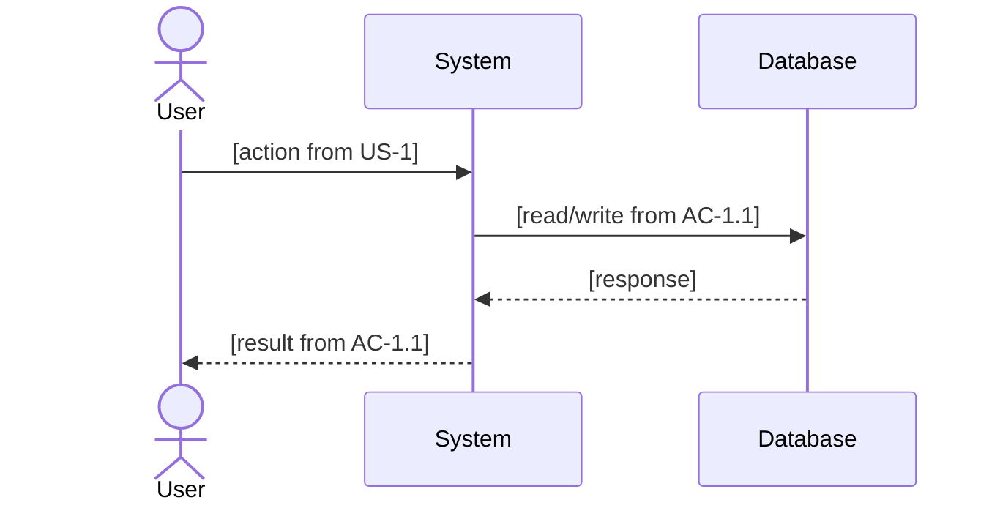
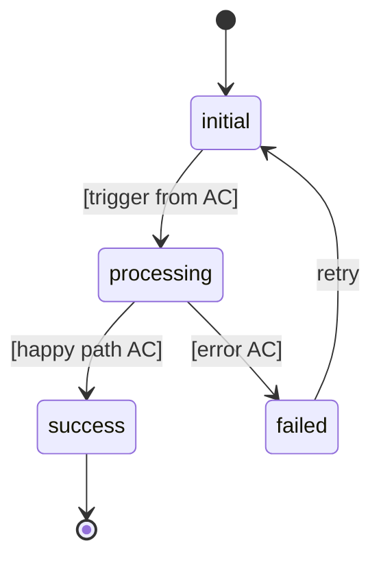

# ba

## Purpose

Business Analyst agent — the ROOT FIX for "Claude works a lot but produces nothing." BA forces deep understanding of WHAT to build before any code is written. It asks probing questions, identifies hidden requirements, maps stakeholders, defines scope boundaries, and produces a structured Requirements Document.

> Wrong requirements shipped correctly is the most expensive bug. BA's job is to prevent it — measure clarity (Step 2.5), measure completeness (Step 3.5), and measure cross-dimension consistency (Step 3.6) before handoff.

<HARD-GATE>
BA produces WHAT, not HOW. Never write code. Never plan implementation.
Output is a Requirements Document → hand off to rune:plan for implementation planning.
</HARD-GATE>

## Triggers

- Called by `cook` Phase 1 when task is product-oriented (not a simple bug fix)
- Called by `scaffold` Phase 1 before any project generation
- `/rune ba <requirement>` — manual invocation
- Auto-trigger: when user description is > 50 words OR contains business terms (users, revenue, workflow, integration)

## Calls (outbound)

- `scout` (L2): scan existing codebase for context
- `research` (L3): look up similar products, APIs, integrations
- `plan` (L2): hand off Requirements Document for implementation planning
- `brainstorm` (L2): when multiple approaches exist for a requirement
- `design` (L2): when requirements include UI/UX components — hand off visual requirements

## Called By (inbound)

- `cook` (L1): before Phase 2 PLAN, when task is non-trivial
- `scaffold` (L1): Phase 1, before any project generation
- `plan` (L2): when plan receives vague requirements
- `brainstorm` (L2): standalone ideation that picked an approach for a new feature with no spec — hands the chosen approach to `ba` for requirements before `plan`
- `mcp-builder` (L2): requirements elicitation before MCP server design
- User: `/rune ba` direct invocation

## Cross-Hub Connections

- `ba` → `plan` — ba produces requirements, plan produces implementation steps
- `ba` → `brainstorm` — ba calls brainstorm when multiple requirement approaches exist
- `ba` ↔ `cook` — cook calls ba for non-trivial tasks, ba feeds requirements into cook's pipeline
- `ba` → `scaffold` — scaffold requires ba output before project generation

## Executable Steps

### Step 1 — Intake & Classify

Read the user's request. Classify the requirement type:

| Type | Signal | Depth |
|------|--------|-------|
| Feature Request | "add X", "build Y", "I want Z" | Full BA cycle (Steps 1-7) |
| Bug Fix | "broken", "error", "doesn't work" | Skip BA → direct to debug |
| Refactor | "clean up", "refactor", "restructure" | Light BA (Step 1 + Step 4 only) |
| Integration | "connect X to Y", "integrate with Z" | Full BA + API research |
| Greenfield | "new project", "build from scratch" | Full BA + market context |

If Bug Fix → skip BA, route to cook/debug directly.
If Refactor → light version (Step 1 + Step 4 only). Skip Steps 2, 2.5, 3, 5, 6.

If existing codebase → invoke `rune:scout` for context before proceeding.

### Step 1.4 — Synthesis Trigger Check
<MUST-READ path="references/synthesis-mode.md" trigger="when prior conversation already contains rich requirement context (pasted spec, > 1000 words discussion, continuation session, filled issue template)"/>

Before proceeding to elicitation, check whether the requirements are **already in context**. Re-asking what the user already told you is the second-most expensive bug.

Activate **Synthesis Mode** instead of standard elicitation if ANY of:

| Signal | Threshold |
|--------|-----------|
| User pasted a spec / PRD / brief | > 200 words describing the feature |
| Conversation has > 1000 words on this feature | Sufficient context already gathered |
| User said "synthesize" / "I already explained" / "just write the spec" | Explicit synthesis request |
| Continuation — `.rune/features/<name>/requirements.md` exists with prior answers | Re-elicitation would duplicate |
| Issue tracker has filled-in template (problem, story, acceptance criteria) | Source already structured |

In Synthesis Mode: extract answers from existing context, draft the Requirements Document with **source citations** for every section, then **confirm** rather than re-interview. Ask follow-ups ONLY on the 1-2 dimensions with genuine gaps. Skip steps 2, 2.5 if all 5 dimensions are filled or partial-but-acceptable.

Workflow detail + anti-patterns: [references/synthesis-mode.md](references/synthesis-mode.md).

### Step 1.5 — Out-of-Scope Match Check (READ)

Before any elicitation, check whether the request matches a concept previously rejected.

1. `Glob` `.out-of-scope/*.md` — if directory absent, skip silently.
2. For each file, parse YAML frontmatter (`concept`, `aliases`).
3. Build a token map (lowercased, split on `-` and whitespace).
4. Tokenize the user's request the same way.
5. Compute lexical overlap per concept; keep the top match's `confidence` (0.0–1.0).

**Action by confidence**:

| Confidence | Verdict | Action |
|------------|---------|--------|
| ≥ 0.8 | exact-match | Surface to user: *"This matches a prior rejection (`.out-of-scope/<slug>.md`) — closed because [body's "Why out of scope" first sentence]. Do you still feel the same way?"* Pause for user response before continuing. |
| 0.5 – 0.79 | similar | Mention inline: *"This is similar to a prior rejection (`<slug>`). Would you like to review it before we proceed?"* Continue regardless of answer. |
| < 0.5 | no-match | Continue silently, no user-facing mention. |

Emit `outofscope.match` signal with `{concept, confidence, verdict}` so downstream skills (cook, plan) inherit the context.

If verdict is exact-match AND user says "yes I still want it" → record their override reason in the Requirements Document `## Risks` section AND mark `priority_to_revisit: high` in the existing `.out-of-scope/<slug>.md` (do NOT delete the file). The override forces the candidate up the revisit ladder; it doesn't erase the prior decision.

If verdict is exact-match AND user accepts the prior rejection → end the BA session with a one-line summary referencing the file. No further questions.

Format reference: [references/out-of-scope-format.md](references/out-of-scope-format.md).

### Step 1.6 — Mid-Elicitation Reject WRITE Path

If the user **explicitly rejects** the feature at any point during elicitation (Steps 2-3) — common phrases: "scrap it", "actually nah, don't build this", "we won't do this", "kill the feature", "drop it" — STOP elicitation and **write a `.out-of-scope/<slug>.md` record** before ending the session.

Without this WRITE path, oral rejections vanish — the next session re-asks the same questions and the user has to re-reject. Step 1.5 (READ) only catches matches against existing files; Step 1.6 (WRITE) is what produces those files in the first place.

<HARD-GATE>
Mid-elicitation rejection MUST produce a `.out-of-scope/<slug>.md` file before session end.
A rejection without a written record is a rejection that didn't happen.
</HARD-GATE>

**Procedure**:

1. **Confirm rejection is durable, not deferral**. Ask one clarifier:
   > "Just to record this correctly: is this **out of scope** (project doesn't want this), or **deferred** (not now but maybe later)? Out-of-scope gets recorded so we don't re-litigate; deferred goes to backlog instead."

   - If **deferred** → route to backlog (no `.out-of-scope/` write), end session with a one-line note
   - If **out-of-scope** → continue to step 2

2. **Capture the durable reason**. Ask:
   > "What's the reason this is out of scope? (project scope, technical constraint, strategic decision — not a temporary circumstance)"

   If the user gives a temporary reason ("we're busy"), reframe: "That's a deferral — should I route to backlog instead?"

3. **Generate slug** (kebab-case, ≤40 chars, recognizable without opening the file).

4. **Lexical-similarity check**: `Glob` `.out-of-scope/*.md`, parse each frontmatter's `concept` + `aliases`, compute overlap. If any existing concept has ≥0.7 overlap → APPEND to that file's `prior_requests` list and mark `rejected_by: ba` for this round. Do NOT create a duplicate.

5. **Write the file** using the format in [`references/out-of-scope-format.md`](references/out-of-scope-format.md):
   - YAML frontmatter (`concept`, `aliases`, `decision: rejected`, `rejected_at`, `rejected_by: ba`, `prior_requests`, optional `revisit_if`)
   - Markdown body: concept name, "Why out of scope" (substantive reasoning from step 2), "What would change our mind" (if user volunteered signals)

6. **Emit `outofscope.recorded`** signal carrying `{slug, rejected_by: ba, prior_requests_count}` so downstream skills know a new rejection landed.

7. **End BA session** with one-line summary:
   > "Recorded as out of scope in `.out-of-scope/<slug>.md`. Future similar requests will surface this. Override anytime by editing the file."

**When NOT to write**:

- User merely defers ("not now") → backlog, not `.out-of-scope/`
- User rejects a single requirement within a larger feature → adjust requirements doc Boundaries section, don't write a whole rejection file (the feature is still in scope)
- Bug rejections (already fixed, not reproducible) → not BA's job; route to incident or close the issue
- The match was already exact (≥0.8) and Step 1.5 surfaced it — user accepting the prior rejection just appends to `prior_requests` of the existing file (handled in Step 1.5 path)

### Step 2.0 — Explore-First Pre-Check (HARD-GATE)

Before emitting ANY of the 5 elicitation questions, run the 4-item pre-check on each intended question:

1. Is the answer in `package.json` / `pyproject.toml` / `Cargo.toml` / `go.mod` / `pom.xml`?
2. Is the answer in `README.md` / `CLAUDE.md` / `docs/`?
3. Is it inferable from file extensions, directory structure, or config files?
4. Has the user answered it earlier in this conversation?

<HARD-GATE>
For every question Q the agent intends to ask, there MUST be prior tool-call evidence in the same session:
- At least 1 Read / Glob / Grep related to Q's domain, OR
- Explicit declaration: "Q cannot be answered from project artifacts because [specific reason]."
Without one of these, Q is BLOCKED — re-route to inference.
</HARD-GATE>

The gate is "tried to infer" — not "must succeed in inferring." If the file genuinely doesn't have the answer, the attempt itself is the gate.

Cache inferred answers in the requirements doc:
```
**Inferred from package.json**: TypeScript 5.4, Next.js 14.2, React 18.3
**Inferred from .github/workflows/**: CI runs on PRs targeting main
```

Worked examples + edge cases: [references/explore-first.md](references/explore-first.md).

### Step 2 — Requirement Elicitation (the "5 Questions")

Ask exactly 5 probing questions, ONE AT A TIME (not all at once):

1. **WHO** — "Who is the end user? What's their technical level? What are they doing right before and after using this feature?"
2. **WHAT** — "What specific outcome do they need? What does 'done' look like from the user's perspective?"
3. **WHY** — "Why do they need this? What problem does this solve? What happens if we don't build it?"
4. **BOUNDARIES** — "What should this NOT do? What's explicitly out of scope?"
5. **CONSTRAINTS** — "Any technical constraints? (existing APIs, performance requirements, security needs, deadlines)"

<HARD-GATE>
Do NOT skip questions. Do NOT answer your own questions.
If user says "just build it" → respond with: "I'll build it better with 2 minutes of context. Question 1: [WHO]"
Each question must be asked separately, wait for answer before next.
Exception: if user provides a detailed spec/PRD → extract answers from it, confirm with user.
</HARD-GATE>

#### Question Discipline (MANDATORY)

Every question the user answers burns attention you don't get back. Protect it.

1. **Max 5 questions total across the whole BA session.** If you find yourself wanting a 6th, the answer is in the first 5 or you're stalling — re-read, don't re-ask.
2. **Prefer yes/no or multiple-choice over open-ended.** An open-ended question is a last resort when no reasonable option set exists.
   - BAD: "What auth strategy do you want?"
   - GOOD: "Auth: **(a)** email+password with JWT, **(b)** OAuth (Google/GitHub), **(c)** magic link, **(d)** I'll decide — pick one."
3. **Never ask what you can infer.** If the answer is in the repo, the user's message, or the classification from Step 1 — don't ask it.
   - Wrong stack? → read `package.json`, don't ask.
   - Wrong audience? → check the `README`, don't ask.
   - Wrong framework? → check config files, don't ask.
4. **Cache the answer.** Write each Q→A pair into the Requirements Document verbatim. If the user restarts the BA session on the same feature, reuse the cached answers — never re-ask what was already answered.
5. **Bundle yes/no questions after Q1 if the user is concise.** A user who replies "y" / "n" / "skip" in 1-2 words tolerates a bundle. A user who replies with paragraphs wants the slow pace — keep one-at-a-time.

Every Q should earn its slot: removing it must leave the Requirements Document materially worse. If it wouldn't, cut the question.

#### Structured Elicitation Frameworks

Choose the framework that fits the requirement type. Use it to STRUCTURE the 5 Questions above, not replace them.

| Framework | When to Use | Structure |
|-----------|------------|-----------|
| **PICO** | Clinical, research, data-driven, or A/B testing features | **P**opulation (who), **I**ntervention (what change), **C**omparison (vs what), **O**utcome (measurable result) |
| **INVEST** | User stories for sprint-sized features | **I**ndependent, **N**egotiable, **V**aluable, **E**stimable, **S**mall, **T**estable |
| **Jobs-to-be-Done** | Product features, user workflows | "When [situation], I want to [motivation] so I can [expected outcome]" |


**PICO Example (data feature):**
```
P: Dashboard users monitoring real-time metrics
I: Add anomaly detection alerts
C: vs. current manual threshold setting
O: 30% faster incident detection (measurable KPI)
```

**When to apply which:**
- Feature Request → INVEST (ensures stories are sprint-ready)
- Data/Analytics/Research feature → PICO (forces measurable outcome definition)
- Product/UX feature → Jobs-to-be-Done (keeps focus on user motivation)
- Integration → 5 Questions only (frameworks add noise for plumbing tasks)

### Step 2.5 — Ambiguity Scoring (Execution Gate)

After each question round, compute an **Ambiguity Score** to determine if requirements are clear enough to proceed. This prevents premature handoff to `plan` with vague inputs.

#### Scoring Formula

```
Ambiguity = 1 - weighted_average(dimensions)

Dimensions (weights vary by requirement type):
  Greenfield:  Goal (40%) + Constraints (30%) + Success Criteria (30%)
  Feature:     Goal (30%) + Constraints (30%) + Success Criteria (20%) + Integration (20%)
  Integration: Goal (20%) + Constraints (25%) + Success Criteria (20%) + API Contract (35%)
```

#### Dimension Scoring (0.0 – 1.0)

| Dimension | 0.0 (Unknown) | 0.5 (Partial) | 1.0 (Clear) |
|-----------|---------------|----------------|--------------|
| **Goal** | "Make it better" | "Improve dashboard performance" | "Dashboard loads in <2s with 10k rows" |
| **Constraints** | No constraints mentioned | "Use existing DB" | "PostgreSQL 15, no new deps, GDPR compliant" |
| **Success Criteria** | "It should work" | "Users can see their data" | "AC-1.1: GIVEN 10k rows WHEN page loads THEN render <2s" |
| **Integration** | "Connect to the API" | "Use REST, need auth" | "POST /api/v2/orders, OAuth2, rate limit 100/min" |
| **API Contract** | "It sends data somewhere" | "JSON payload to endpoint" | "OpenAPI spec provided, request/response schemas defined" |

#### Threshold Gate

| Ambiguity | Level | Action |
|-----------|-------|--------|
| **< 15%** | Crystal Clear | Proceed to Step 3 immediately |
| **15-25%** | Acceptable | Proceed with noted assumptions — flag gaps in Requirements Doc |
| **25-40%** | Unclear | Ask 1-2 targeted follow-up questions on weakest dimension |
| **> 40%** | Blocked | Do NOT proceed. Re-ask the weakest dimension question with examples |

<HARD-GATE>
NEVER hand off to plan with Ambiguity > 40%.
If user insists "just build it" at > 40%, respond:
"Ambiguity is [X]% — the weakest area is [dimension]. One more answer cuts this in half: [targeted question]"
</HARD-GATE>

#### Scoring After Each Question

After each of the 5 Questions (Step 2), update the score:

```
Round 1 (WHO):    Goal ≈ 0.3, others = 0.0 → Ambiguity ≈ 91%
Round 2 (WHAT):   Goal ≈ 0.7, Success ≈ 0.3 → Ambiguity ≈ 72%
Round 3 (WHY):    Goal ≈ 0.9, Success ≈ 0.5 → Ambiguity ≈ 47%
Round 4 (BOUNDS): Constraints ≈ 0.6 → Ambiguity ≈ 30%
Round 5 (CONSTR): Constraints ≈ 0.9 → Ambiguity ≈ 12% ✅
```

If Ambiguity drops below 15% before all 5 questions are asked (e.g., user provides a detailed PRD), skip remaining questions and proceed. The gate is about clarity, not ceremony.

#### Display Format

After completing Step 2, show the user:

```
Clarity Score: [100 - ambiguity]%
  Goal:             [██████████] 0.9
  Constraints:      [████████░░] 0.8
  Success Criteria: [██████░░░░] 0.6  ← weakest
  Status: ACCEPTABLE (ambiguity 23%) — proceeding with noted gaps
```

### Step 2.6 — CONTEXT.md Cross-Reference Gate

After elicitation, before hidden-requirement discovery, scan the user's answers for assertions about *current behavior* — phrasings like "the system X", "the code does X", "we already X", "right now it X".

For each such assertion:

1. `Grep` the codebase for evidence (function names, route handlers, schema definitions matching the asserted behavior).
2. Compare grep results to the user's claim.

| Outcome | Action |
|---------|--------|
| Grep confirms claim | Proceed; record term in CONTEXT.md if domain-relevant |
| Grep contradicts claim | <HARD-GATE>Surface the conflict immediately. *"You said the system does X, but the code path I see does Y. Which is canonical?"* Pause until resolved.</HARD-GATE> |
| Grep returns nothing | Note as unverified; ask user for the file/function name; do not record in CONTEXT.md until verified |

This gate prevents the agent from silently transcribing user-asserted behavior that contradicts code — a common source of "the docs say X but the code does Y" drift.

### Step 3 — Hidden Requirement Discovery

After the 5 questions, analyze for requirements the user DIDN'T mention:

**Technical hidden requirements:**
- Authentication/authorization needed?
- Rate limiting needed?
- Data persistence needed? (what DB, what schema)
- Error handling strategy?
- Offline/fallback behavior?
- Mobile responsiveness?
- Accessibility requirements?
- Internationalization?

**Business hidden requirements:**
- What happens on failure? (graceful degradation)
- What data needs to be tracked? (analytics events)
- Who else is affected? (other teams, other systems)
- What are the edge cases? (empty state, max limits, concurrent access)
- Regulatory/compliance needs? (GDPR, PCI, HIPAA)

Present discovered hidden requirements to user: "I found N additional requirements you may not have considered: [list]. Which are relevant?"

### Step 3.5 — Completeness Scoring (Options & Alternatives)

When presenting options, alternatives, or scope decisions to the user, rate each with a **Completeness score (X/10)**:

| Score | Meaning | Guidance |
|-------|---------|----------|
| 9-10 | Complete — all edge cases, full coverage, production-ready | Always recommend |
| 7-8 | Covers happy path, skips some edges | Acceptable for MVP |
| 4-6 | Shortcut — defers significant work to later | Flag trade-off explicitly |
| 1-3 | Minimal viable, technical debt guaranteed | Only for time-critical emergencies |

**Always recommend the higher-completeness option** unless the delta is truly expensive. With AI-assisted coding, the marginal cost of completeness is near-zero:

| Task Type | Human Team | AI-Assisted | Compression |
|-----------|-----------|-------------|-------------|
| Boilerplate / scaffolding | 2 days | 15 min | ~100x |
| Test writing | 1 day | 15 min | ~50x |
| Feature implementation | 1 week | 30 min | ~30x |
| Bug fix + regression test | 4 hours | 15 min | ~20x |

**When showing effort estimates**, always show both scales: `(human: ~X / AI: ~Y)`. The compression ratio reframes "too expensive" into "15 minutes more."

**Anti-pattern**: "Choose B — it covers 90% of the value with less code." → If A is only 70 lines more, choose A. The last 10% is where production bugs hide.


### Step 3.6 — Logic Consistency Check

After ambiguity + completeness pass, scan for **cross-dimension contradictions**. Ambiguity measures CLARITY of each dimension in isolation; this step measures CONSISTENCY across dimensions. A perfectly clear requirement can still contradict itself.

#### Checks

Run each, label verdict 🟢 pass / 🟡 warn / 🔴 fail:

| # | Check | 🔴 Fail | 🟢 Pass |
|---|-------|---------|---------|
| 1 | Every Acceptance Criterion traces to a User Story | AC orphaned | 1:N mapping clear |
| 1b | Every EARS `FR-n` (Step 4.5) traces up to a User Story AND down to an AC | FR has no AC (untested promise) or no story (orphan behavior) | FR → story + AC both present |
| 2 | Every Business Rule (Q5) is enforced in an AC or Exception Flow | Rule has no enforcement path | Rule → specific AC or exception |
| 3 | Scope IN ∩ Scope OUT = ∅ | Direct overlap in phrasing | Sets disjoint |
| 4 | Every user-story flow has a terminal state | State loop without exit condition | Terminal state explicit |
| 5 | Dependencies (Step 4) ⊂ Constraints acknowledged (Q5) | Dependency never mentioned in constraints | All deps covered |
| 6 | NFRs measurable against at least one AC | NFR has no test hook | Every NFR → testable AC |
| 7 | Hidden requirements (Step 3) resolved in/out | Silent inclusion | User confirmed inclusion or exclusion |
| 0 | Prior rejection check (Step 1.5) — exact-match resolved with explicit override or session ended | Silent re-litigation of rejected concept | User chose: override (priority bumped) OR accept prior decision (session ends) |

#### Output Format

```
Logic Consistency Report:
  1. AC → User Story:      🟢 all AC trace to US-1 or US-2
  1b. EARS FR → story+AC:  🟢 FR-1..FR-5 each map to a story and an AC
  2. Business rule → AC:   🟡 "no duplicate emails" cited — exception flow missing
  3. Scope disjoint:       🟢
  4. Terminal states:      🟢
  5. Deps in constraints:  🔴 "PostgreSQL 15" missing from Q5 answer
  6. NFR measurable:       🟢
  7. Hidden reqs resolved: 🟢

Verdict: 1 🔴, 1 🟡, 5 🟢 → BLOCK handoff until 🔴 fixed
```

#### Gate Rule

| Result | Action |
|--------|--------|
| 0 🔴 | Proceed to Step 4 — 🟡 warnings become "Risks" in Requirements Doc |
| 1-2 🔴 | BLOCK — ask targeted question or re-scope to resolve each 🔴 |
| 3+ 🔴 | Scrap Steps 2-3 and restart — requirements structurally incoherent |

<HARD-GATE>
NEVER hand off to plan with unresolved 🔴. Ambiguity ≤ 40% does not imply consistency — they are orthogonal gates.
If user pushes "just build it" with 🔴 present, respond: "Contradiction in [dimension]: [specific conflict]. One clarification fixes this: [targeted question]"
</HARD-GATE>

### Step 4 — Scope Definition

Based on all gathered information, produce:

**In-Scope** (explicitly included):
- [list of features/behaviors that WILL be built]

**Out-of-Scope** (explicitly excluded):
- [list of things we WON'T build — prevents scope creep]

**Assumptions** (things we're assuming without proof):
- [each assumption is a risk if wrong]

**Dependencies** (things that must exist before we can build):
- [APIs, services, libraries, access, existing code]

### Step 4.5 — Functional Requirements (EARS)
<MUST-READ path="references/ears-format.md" trigger="when writing the functional-requirements section for a Feature/Integration/Greenfield requirement"/>

Translate each in-scope item (Step 4) into atomic, testable **functional requirements** using EARS (Easy Approach to Requirements Syntax). EARS sits between user stories (WHY) and acceptance criteria (HOW we prove it) — it names exactly WHAT the system shall do, with an explicit trigger or condition.

Pick the simplest EARS template that fits each behavior; give each a stable ID (`FR-1`, `FR-2`, …):

| Type | Template |
|------|----------|
| Ubiquitous | The `<system>` shall `<response>`. |
| Event-driven | When `<trigger>`, the `<system>` shall `<response>`. |
| State-driven | While `<state>`, the `<system>` shall `<response>`. |
| Optional | Where `<feature is included>`, the `<system>` shall `<response>`. |
| Unwanted | If `<unwanted condition>`, then the `<system>` shall `<response>`. |
| Complex | While `<state>`, when `<trigger>`, the `<system>` shall `<response>`. |

```
FR-1  The API shall return responses in JSON.
FR-2  When a request omits a valid auth token, the API shall respond with HTTP 401.
FR-3  If the payment provider times out, then the system shall mark the order pending and queue a retry.
```

Rules (full guidance in [references/ears-format.md](references/ears-format.md)):
- **One `shall` per requirement** — compound "shall do A and B" splits into two `FR-n`.
- **Named subject, testable response** — never "it shall handle gracefully". Move measurable limits into the response; pure performance targets stay in NFRs (Step 6).
- **Don't smuggle HOW** — observable behavior only; leave implementation to `plan`.
- Every `FR-n` traces up to a User Story and down to an Acceptance Criterion (checked in Step 3.6).

**Skip EARS** for Bug Fix and Refactor types (no new behavior to specify). For plumbing/integration, a few event-driven + unwanted-behavior lines suffice — don't pad with ubiquitous filler. EARS is a format recommendation, not a gate.

### Step 5 — User Stories & Acceptance Criteria

For each in-scope feature, generate:

```
US-1: As a [persona], I want to [action] so that [benefit]
  AC-1.1: GIVEN [context] WHEN [action] THEN [result]
  AC-1.2: GIVEN [error case] WHEN [action] THEN [error handling]
  AC-1.3: GIVEN [edge case] WHEN [action] THEN [graceful behavior]
```

Rules:
- Primary user story first, then edge cases
- Every user story has at least 2 acceptance criteria (happy path + error)
- Acceptance criteria are TESTABLE — they become test cases in Phase 3
- Each AC proves a specific `FR-n` from Step 4.5 — cite it (`AC-1.2 → FR-3`). Every unwanted-behavior `FR` (the `If …` lines) needs an error-path AC; that's where EARS earns its keep

### Step 6 — Non-Functional Requirements (NFRs)

Assess and document ONLY relevant NFRs:

| NFR | Requirement | Measurement |
|-----|-------------|-------------|
| Performance | Page load < Xs, API response < Yms | Lighthouse, k6 |
| Security | Auth required, input validation, OWASP top 10 | sentinel scan |
| Scalability | Expected users, data volume | Load test target |
| Reliability | Uptime target, error budget | Monitoring threshold |
| Accessibility | WCAG 2.2 AA | Axe audit |

Only include NFRs relevant to this specific task. Don't generate a generic checklist.

### Step 6.5 — Tiered Recommendations

For product-oriented requirements (Feature Request, Integration, Greenfield), generate **tiered strategic recommendations**. This structures the path forward into actionable time horizons.

**Three Tiers:**

| Tier | Timeframe | Focus | Characteristics |
|------|-----------|-------|-----------------|
| **Quick Win** | 0-30 days | Immediate impact | Low effort, high visibility, builds momentum |
| **Differentiation** | 1-3 months | Competitive edge | Medium effort, unique value, hard to copy |
| **Long-term Moat** | 6-12 months | Sustainable advantage | High effort, defensible, compounds over time |

**For each tier, specify:**

```markdown
### Quick Win (0-30 days)
- **Action**: [Specific deliverable]
- **Resources**: [Team size, tools, dependencies]
- **Expected Impact**: [Measurable outcome]
- **Risk if skipped**: [What happens without this]

### Differentiation (1-3 months)
- **Action**: [...]
- **Resources**: [...]
- **Expected Impact**: [...]
- **Risk if skipped**: [...]

### Long-term Moat (6-12 months)
- **Action**: [...]
- **Resources**: [...]
- **Expected Impact**: [...]
- **Risk if skipped**: [...]
```

**Rules:**
- Quick Win MUST be achievable in first sprint — no dependencies on later tiers
- Differentiation should create switching costs or unique capabilities
- Long-term Moat should compound (network effects, data moats, ecosystem lock-in)
- Every tier includes "Risk if skipped" — makes trade-offs explicit
- Skip this step for Bug Fix and Refactor types (no strategic dimension)

### Step 7 — Artifact Triad

Produce three structured artifacts — not one prose doc. Plan consumes all three; each answers a different question.

| Artifact | Question Answered | Consumer |
|----------|-------------------|----------|
| `requirements.md` | WHAT to build and WHY | plan, cook |
| `requirements.mermaid` | WHAT does the flow look like visually | plan, design, review |
| `tasks.md` | WHAT work layers exist | plan (as task backbone, not from scratch) |

#### Artifact 1: requirements.md

Structured document combining Steps 1-6.5. Save to `.rune/features/<feature-name>/requirements.md`:

```markdown
# Requirements Document: [Feature Name]
Created: [date] | BA Session: [summary]

## Context
[Problem statement — 2-3 sentences]

## Stakeholders
- Primary user: [who]
- Affected systems: [what]

## User Stories
[from Step 5]

## Functional Requirements
[from Step 4.5 — EARS-format FR-n list; skip for Bug Fix/Refactor]

## Scope
### In Scope
### Out of Scope
### Assumptions

## Non-Functional Requirements
[from Step 6]

## Dependencies
[from Step 4]

## Risks
- [risk]: [mitigation]

## Strategic Recommendations
[from Step 6.5 — skip for Bug Fix/Refactor]

## Logic Consistency Report
[from Step 3.6 — verbatim, for audit trail]

## Next Step
→ Hand off to rune:plan (consumes all 3 artifacts)
```

#### Artifact 2: requirements.mermaid

Auto-generate from User Stories. Save to `.rune/features/<feature-name>/requirements.mermaid`.

**Sequence diagram** (primary happy path from US-1):



**State machine** (only if any User Story implies state):



Skip state machine if feature is stateless (simple CRUD with no lifecycle). Sequence is always produced.

#### Artifact 3: tasks.md

Pre-broken implementation tasks by layer. Plan refines this backbone, does not create from scratch. Save to `.rune/features/<feature-name>/tasks.md`:

```markdown
# Implementation Tasks: [Feature Name]

## Data Layer
- [ ] Schema — [tables/models from AC]
- [ ] Migration up + down
- [ ] Seed/fixtures if tests need them

## Logic Layer
- [ ] [each Q5 Business Rule → one task]
- [ ] Validation for [each AC error case]
- [ ] State transitions from requirements.mermaid (if present)

## Interface Layer (API / UI)
- [ ] [each User Story → one endpoint or UI component]
- [ ] Contract schema from AC (request/response)
- [ ] Error handling for [each AC error]

## Test Layer
- [ ] Unit: [each business rule → one test]
- [ ] Integration: [each AC happy path]
- [ ] Regression: [each AC error case]

## NFR Verification
- [ ] [each NFR from Step 6 → one measurement task]
```

Derivation rules:
- 1 User Story → ≥1 Interface task
- 1 Business Rule → 1 Logic task + 1 Unit test task
- 1 AC → ≥1 Test task (happy path + error)
- 1 NFR → 1 NFR Verification task

#### Handoff

Emit signal to `plan` with paths to all three artifacts. Plan MUST read all three before producing phase files — the triad is the contract.

### Step 7.5 — Glossary Sharpen (CONTEXT.md update)

After the artifact triad is saved, append/update the project glossary `CONTEXT.md` with any domain terms that were sharpened during this session.

1. Determine glossary location:
   - If `CONTEXT-MAP.md` exists at root → multi-context; pick the right per-context CONTEXT.md
   - Else if root `CONTEXT.md` exists → use it
   - Else if any term needs recording → create root `CONTEXT.md` lazily
   - Else → skip silently (no-op when no terms emerged)
2. For each new term, add a row to the **Language** table (term, definition, aliases-to-avoid, status).
3. For each user-asserted relationship, add to the **Relationships** section.
4. For each ambiguity surfaced during elicitation, add to **Flagged ambiguities**.

**Conflict gate** — if a new term has ≥0.7 token overlap with an existing one, surface to user (merge / rename / keep distinct). NEVER silently re-define an existing term.

Format reference: [references/context-md-format.md](references/context-md-format.md).

## Output Format

Triad of artifacts under `.rune/features/<feature-name>/`:

| File | Template Reference |
|------|-------------------|
| `requirements.md` | Step 7 Artifact 1 |
| `requirements.mermaid` | Step 7 Artifact 2 (sequence + optional state machine) |
| `tasks.md` | Step 7 Artifact 3 (Data / Logic / Interface / Test / NFR layers) |

Inside `requirements.md` the **Decision Classification** table MUST appear verbatim — plan gates on Decision compliance, Discretion items skip approval:

| Category | Meaning | Example |
|----------|---------|---------|
| **Decisions** (locked) | User confirmed — agent MUST follow | "Use PostgreSQL, not MongoDB" |
| **Discretion** (agent decides) | User trusts agent judgment | "Pick the best validation library" |
| **Deferred** (out of scope) | Explicitly NOT this task | "Mobile app — future phase" |

## Constraints

1. MUST ask up to 5 probing questions before producing requirements — never more, skip any you can infer from context
2. MUST prefer yes/no or multiple-choice questions — open-ended only when no reasonable option set exists
3. MUST NOT ask for information already present in the user's message, the repo, or classification — read/grep first, ask second
4. MUST cache each Q→A pair in the Requirements Document and reuse on subsequent BA sessions for the same feature
5. MUST identify hidden requirements — the obvious ones are never the full picture
6. MUST define out-of-scope explicitly — prevents scope creep
7. MUST produce testable acceptance criteria — they become test cases
8. MUST NOT write code or plan implementation — BA produces WHAT, plan produces HOW
9. MUST ask ONE question at a time by default; bundle yes/no batches only after user shows concise replies
10. MUST NOT skip BA for non-trivial tasks — "just build it" gets redirected to Question 1

## Returns

| Artifact | Format | Location |
|----------|--------|----------|
| Requirements document | Markdown | `.rune/features/<feature-name>/requirements.md` |
| Visual model | Mermaid (sequence + optional state machine) | `.rune/features/<feature-name>/requirements.mermaid` |
| Implementation task backbone | Markdown checklist by layer | `.rune/features/<feature-name>/tasks.md` |
| Logic Consistency Report | Markdown section | Embedded in requirements.md |
| Ambiguity + Completeness scores | Markdown display blocks | Embedded in requirements.md |

## Sharp Edges

Known failure modes for this skill. Check these before declaring done.

| Failure Mode | Severity | Mitigation |
|---|---|---|
| Skipping questions because "requirements are obvious" | CRITICAL | HARD-GATE: 5 questions mandatory, even for "simple" tasks |
| Answering own questions instead of asking user | HIGH | Questions require USER input — BA doesn't guess |
| Producing implementation details (HOW) instead of requirements (WHAT) | HIGH | BA outputs requirements doc → plan outputs implementation |
| All-at-once question dump (asking 5 questions in one message) | MEDIUM | One question at a time, wait for answer before next |
| Asking open-ended questions when yes/no or multiple-choice would work | HIGH | Question Discipline rule 2 — option sets are faster to answer and easier to cache |
| Asking for info already in the repo/message (stack, framework, audience) | HIGH | Question Discipline rule 3 — read `package.json`/README/config first, ask only what you genuinely can't find |
| Exceeding 5 questions when the user seems "engaged" | MEDIUM | Question Discipline rule 1 — hard cap at 5. A 6th question is a sign of stalling, not thoroughness |
| Re-asking on session restart when answers were cached | MEDIUM | Question Discipline rule 4 — load `.rune/features/<name>/requirements.md` and reuse cached Q→A pairs |
| Missing hidden requirements (auth, error handling, edge cases) | HIGH | Step 3 checklist is mandatory scan |
| Requirements doc too verbose (>500 lines) | MEDIUM | Max 200 lines — concise, actionable, testable |
| Skipping BA for "simple" features that turn out complex | HIGH | Let cook's complexity detection trigger BA, not user judgment |
| Recommending shortcuts without Completeness Score | MEDIUM | Step 3.5: every option needs X/10 score + dual effort estimate (human vs AI). "90% coverage" is a red flag when 100% costs 15 min more |
| Handing off to plan with ambiguity > 40% | CRITICAL | Step 2.5 HARD-GATE: compute ambiguity score after elicitation, block handoff if > 40%, ask targeted follow-up on weakest dimension |
| Skipping ambiguity scoring because "user seems clear" | HIGH | Always compute the score — perceived clarity ≠ measured clarity. The formula catches gaps humans miss |
| Tiered recommendations too vague ("improve things") | MEDIUM | Each tier needs specific Action + measurable Expected Impact. "Build better UX" → "Reduce checkout steps from 5 to 3, targeting 15% conversion lift" |
| All three tiers have same resources/effort | MEDIUM | Quick Win should be low-effort. If all tiers need "2 engineers, 3 months" → re-scope Quick Win to something achievable in 1 sprint |
| Skipping Logic Consistency check because ambiguity is low | CRITICAL | Step 3.6 HARD-GATE: clarity ≠ consistency. A 90% clarity spec can still contain pairwise contradictions (scope IN/OUT overlap, rules with no enforcement, orphan ACs) |
| Handing off to plan with unresolved 🔴 consistency fails | CRITICAL | Step 3.6 gate: 1+ 🔴 = BLOCK. 🟡 allowed only when logged as Risk in requirements.md |
| Vague functional requirements ("system shall be fast/user-friendly") instead of EARS | MEDIUM | Step 4.5: every FR uses an EARS template with a named subject + testable response; vague targets move to NFRs (Step 6) |
| Compound EARS requirement ("shall do A and B and C") hiding untested behavior | MEDIUM | Step 4.5: one `shall` per `FR-n` — split compounds so each behavior gets its own AC |
| EARS `FR-n` with no acceptance criterion (untested promise) | MEDIUM | Step 3.6 check 1b: every FR traces down to an AC and up to a User Story |
| Manufacturing EARS requirements for a bug fix or refactor | LOW | Step 4.5: skip EARS when there's no new behavior to specify — format recommendation, not ceremony |
| Producing only requirements.md, skipping mermaid and tasks.md | HIGH | Step 7 is a triad — plan's contract expects all 3. Sequence diagram is always produced; state machine only if stateful; tasks.md always produced |
| Mermaid diagram unrelated to actual user stories (decorative only) | MEDIUM | Sequence must trace AC-1.1 of US-1; state machine nodes must map to state-bearing ACs. Auditable by pattern-match |
| tasks.md as flat list instead of layered | MEDIUM | Derivation rules enforce 1 US → Interface task, 1 rule → Logic + Unit test, 1 AC → Test task, 1 NFR → verification. Skipping layers loses plan's backbone structure |
| Re-litigating a previously rejected concept without surfacing it | HIGH | Step 1.5 HARD-GATE: scan `.out-of-scope/` first; exact match (≥0.8) MUST be surfaced before elicitation begins |
| Skipping Step 1.5 because `.out-of-scope/` directory looks empty | MEDIUM | Empty directory is silent-skip OK; directory absent entirely is silent-skip OK; never skip due to "I don't think this matches anything" — let the matcher decide |
| User asserts behavior; agent records user's version without grep verification | HIGH | Step 2.6 HARD-GATE: every "the system does X" assertion gets grep'd; conflicts surface to user before recording |
| Silently re-defining an existing CONTEXT.md term | HIGH | Step 7.5 conflict gate: ≥0.7 overlap → user chooses merge/rename/keep-distinct |
| Auto-creating an empty CONTEXT.md when no terms emerged | LOW | Lazy creation rule: only write when there's a non-trivial term to record |
| Mid-elicitation rejection ("scrap it") that ends the session without writing `.out-of-scope/` | CRITICAL | Step 1.6 HARD-GATE: explicit rejection MUST produce `.out-of-scope/<slug>.md` before session end — oral rejections vanish, force re-litigation next session |
| Writing `.out-of-scope/` for a deferral instead of routing to backlog | MEDIUM | Step 1.6 procedure step 1: confirm "out of scope" vs "deferred" — temporary reasons go to backlog, not the rejection KB |
| Running 5-question elicitation when conversation already contains rich context | HIGH | Step 1.4: synthesis-trigger check fires before Step 2 — pasted spec / >1000 words / continuation / explicit "synthesize" → switch to Synthesis Mode (extract + cite + confirm), don't re-interview |
| Synthesizing requirements without source citations | HIGH | Synthesis Mode requires citing source for every dimension (user message N, pasted doc, continuation file). User cannot verify interpretation without citations |
| Auto-handoff to plan after synthesis without explicit user "go"/"locked" confirmation | HIGH | Synthesis is interpretation, not transcription. Without explicit confirmation, drift becomes a downstream bug |
| Asking inferable questions ("what stack are you using?") without first checking package.json | HIGH | Step 2.0 HARD-GATE — every question requires prior tool-call evidence (Read/Glob/Grep) or explicit unavailability declaration |
| Re-asking a question already answered earlier in the conversation | MEDIUM | Step 2.0 check 4 — cache and reuse, never re-ask |

## Done When

- Requirement type classified (feature/refactor/integration/greenfield)
- 5 probing questions asked and answered (or extracted from spec/PRD)
- Ambiguity Score computed and displayed — must be ≤ 40% before proceeding (≤ 25% preferred)
- Hidden requirements discovered and confirmed with user
- Scope defined (in/out/assumptions/dependencies)
- Functional requirements written in EARS format (FR-n) — skip for Bug Fix/Refactor
- User stories with testable acceptance criteria produced, each AC citing the `FR-n` it proves
- Non-functional requirements assessed (relevant ones only)
- Logic Consistency Report produced — 0 🔴 before handoff (🟡 logged as Risks)
- Tiered recommendations generated (Quick Win / Differentiation / Moat) — skip for Bug Fix/Refactor
- Artifact triad saved: `requirements.md` + `requirements.mermaid` + `tasks.md`
- Out-of-scope match check completed (verdict logged: no-match | similar | exact-match-overridden | exact-match-accepted)
- Handed off to `plan` for implementation planning

## Cost Profile

~3000-6000 tokens input, ~1500-3000 tokens output. Opus for deep requirement analysis — understanding WHAT to build is the most expensive mistake to get wrong.
